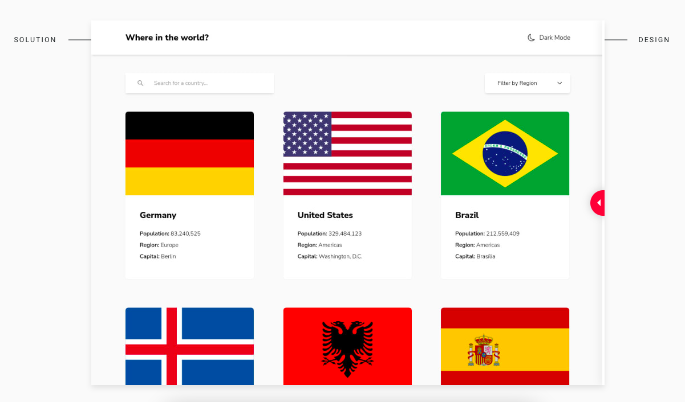

# Frontend Mentor - REST Countries API with color theme switcher solution

This is a solution to the [REST Countries API with color theme switcher challenge on Frontend Mentor](https://www.frontendmentor.io/challenges/rest-countries-api-with-color-theme-switcher-5cacc469fec04111f7b848ca). Frontend Mentor challenges help you improve your coding skills by building realistic projects.

## Table of contents

- [Frontend Mentor - REST Countries API with color theme switcher solution](#frontend-mentor---rest-countries-api-with-color-theme-switcher-solution)
  - [Table of contents](#table-of-contents)
  - [Overview](#overview)
    - [The challenge](#the-challenge)
    - [Screenshot](#screenshot)
    - [Links](#links)
  - [Built with](#built-with)
  - [Project Highlights](#project-highlights)
  - [Running the project](#running-the-project)
  - [Deploying the project](#deploying-the-project)
  - [Author](#author)

## Overview

### The challenge

Users should be able to:

- See all countries from the API on the homepage
- Search for a country using an `input` field
- Filter countries by region
- Click on a country to see more detailed information on a separate page
- Click through to the border countries on the detail page
- Toggle the color scheme between light and dark mode _(optional)_

### Screenshot

### Links

- Solution URL: [https://github.com/tiagobw/rest-countries-api-with-color-theme-switcher](https://github.com/tiagobw/rest-countries-api-with-color-theme-switcher)
- Live Site URL: [https://rest-countries-api-with-color-theme-switcher-frontendmentor.netlify.app/](https://rest-countries-api-with-color-theme-switcher-frontendmentor.netlify.app/)

## Built with

- Semantic HTML5 markup
- Mobile-first workflow
- CSS Grid
- Flexbox
- React
- TypeScript
- Tailwind CSS

## Project Highlights

- The use of TypeScript for type safety.
- Progressive Web App (PWA) ready to install.
- A combination of React Context and useReducer to manage the Countries' state.
- Tailwind's `dark` variant + React Context to manage the Dark and Light themes.
- I've tried to decouple the Country class as a domain model. (It needs better work on that).

## Running the project

`npm start` or `yarn start`

Runs the app in development mode. 
Open [http://localhost:3000](http://localhost:3000) to view it in the browser.

## Deploying the project

`npm run build` or `yarn build`

Builds the app for production to the `build` folder. 
It correctly bundles React in production mode and optimizes the build for the best performance.

The build is minified and the filenames include the hashes. 

The app is ready to be deployed.

## Author

- Frontend Mentor - [@tiagobw](https://www.frontendmentor.io/profile/tiagobw)
